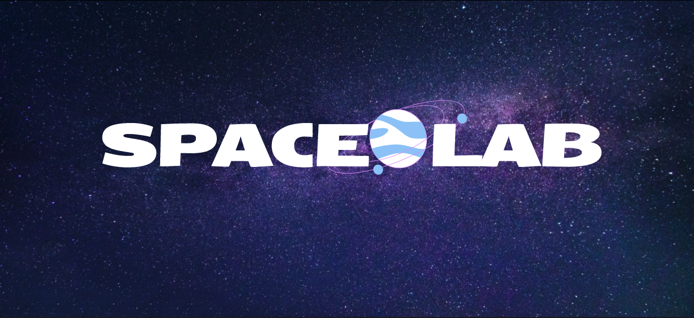

<!-- PROJECT LOGO -->
<br />
<div align="center">
  <a href="https://github.com/spacelabdev/spacelab-react">
    
  </a>


<!-- INTRODUCTION -->

## Introduction

<a href="https://github.com/spacelabdev/spacelab-react">
    
</a>

<h4>Welcome to the developer guide for Spacelab!</h4>

This guide is intended to provide instructions on how to contribute to the project, including coding conventions and style guidelines that ensure consistency throughout the codebase. By following these guidelines, you can help us create a high-quality project that is easy to update and maintain.

Whether you are a seasoned developer or just starting out, this guide will provide you with the information you need to contribute effectively to the project. If you are new to Spacelab please read through this document carefully!

Let's get started!

<!-- GETTING STARTED -->

## Getting Started

To get a local copy of the project, follow these steps.

### Prerequisites

Make sure you have the latest npm package installed

```sh
npm install npm@latest -g

```

Make sure you have the latest version of node installed.

We recommend using a node manager to switch between node versions.  
If you are on Mac or Linux you can install [nvm](https://github.com/nvm-sh/nvm) to manage your node versions. For windows, you can use [nvm for Windows](https://github.com/coreybutler/nvm-windows)

```sh
  nvm install 18.16.0
  nvm use 18.16.0
```

### Installation

1. Clone (or fork) the repo
    ```sh
    git clone https://github.com/spacelabdev/fund_lab_force
    ```
2. Install NPM packages
    ```sh
    npm install
    ```
3. Spin up the Project
    ```
    npm run dev
    ```

## General Workflow

In general, the flow goes like this:

1. Update your local version of main: (`git pull`) (in your main branch)
2. Create your Feature Branch (`git checkout -b feature/AmazingFeature`)
3. Commit some Changes (`git commit -m 'Add some AmazingFeature'`)
4. Rebase your branch to have the latest updates from main (`git rebase origin main`)
5. Push your branch to the remote (`git push origin feature/AmazingFeature`)
6. Open a Pull Request and include a screenshot of the feauture you worked on

**Never push changes directly to main, always use a feature branch!**

**Delete your branches once they're merged.**


## Git Branching, Merge vs. Rebase, and Pull Requests

When fixing a bug or creating a new feature, please use a separate branch called a feature branch.

### Creating a Feature Branch

To check out a feature branch:

```
git checkout -b feature/amazingFeature
```

Branch Naming Conventions:

-   feature/nameOfFeature: New feature or comoponent
-   enhancement/nameOfFeature: Enhancement of exsisting feature or component
-   hotfix/nameOfBug: Quick bug or update

### Merge vs. Rebase

Merge and rebase are two strategies for integrating branches in git.

Merge:

-   Easiest option
-   Non destructive, keeps the original commit history of both branches
-   In projects with lots of developers using merge can create a messy commit history
-   `git rebase origin main`

Rebase:

-   Alters the commit history, gives the ability to squash commits
-   Destructive, should only be used on private branches
-   When used correctly can creates a neat commit history
-   `git merge origin main`

Use rebase ONLY when you are working on a private branch, meaning you are the only developer making changes to the branch, and you haven’t created a PR yet. You should rebase your feature branch every time before creating your PR, or if there are changes that have been made to main that you need to incorporate in your branch.

Use merge when on public branches, meaning there are multiple people making changes to the branch, or you have already submitted a PR and need to update something in the code.

To reset your branch to match the remote you can run:

```
git reset --hard origin/"Your branch"
```

### Submitting a Pull Request

PR's should be submitted when your feature/bug-fix is complete and has been tested.

Before submitting a PR, run through this code checklist:

1. Remove any console.logs and unnecessary comments in your code
2. Add alt tags to all images, labels to all inputs, and check that your html is semantic
3. Make sure styles are properly nested so that other parts of the site aren't affected
4. Test your feature/page on mobile/tablet/desktip in dev tools and check that it doesn't break
5. Check that Webpack compiles without warnings, resolve any errors before pushing
6. Rebase your branch with main and check that it is up to date

Once you complete the checklist, open a PR and include a short description of what you accomplished. If you built a new feature, include a screenshot of the UI.

## Style Guide

Please refer to [globalStyles](https://github.com/spacelabdev/fund_lab_force/blob/main/src/globalStyles.scss) as it contains color pallettes for the website as well as default styles for headings, buttons, inputs, etc.

In general, developers should try to follow designs from the UX/UI team as closely as possible (down to the pixel if you can).

If a piece of a design isn't possible, or if the design looks funky when translated into code, please message the UX designer who created it to let them know. Until they can redesign that portion, use your best judgement to fix the issue.

## Coding Conventions and Guidelines

Some of these conventions haven't been implemented throughout the entire site yet, so if you see a piece of code that doesn't match these guides, go ahead and update it:)

Naming Conventions:

1. All React component names and file names should be Pascal Case.

2. All files written in jsx should have the extension .jsx, and any files that are pure javascript should have the .js extension.

3. For css classes use hypen deliminated strings, for example: .example-class

4. Otherwise, please use camelCase for naming

Coding Conventions:

1. Responsiveness:
   Components should be designed mobile first and tested thoroughly. Breakpoints are set at:

    - 576px for portrait phones
    - 768px for tablets
    - 992px for laptops
    - 1200px for large devices

    Media queries should use the screen and min-width properties like so:

    ```
      @media screen and (min-width: 1024px) {
      ...
      }
    ```

2. Accessibility:

    - Write semantic html
    - Include alt attributes on all images
    - Include labels on all inputs

3. Performance:
    - Keep your code modular and resuable
    - Do not use let or var to declare your variables, instead use const
    - Remove all console.logs

## Thank You For Reading and Welcome to Spacelab!

<p>(<a href="#top">back to top</a>)</p>
